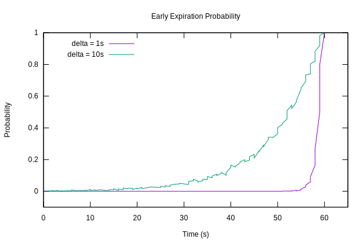

# xfetch-rs

Rust crate for Optimal Probabilistic Cache Stampede Prevention aka XFetch algorithm

## Cache Stampede

A cache stampede is a type of cascading failure that can occur when
massively parallel computing systems with caching mechanisms come under
very high load. This behaviour is sometimes also called dog-piling.

Under normal load, cache misses will trigger a recomputation to refresh the
cache. Other process or thread can continue as before.

Under heavy load, cache misses may trigger multipre process / threads trying
to refresh content thus add more loading to the resource source which the
cache was meant to reduce the loading.

Several approaches can be used to mitigate cache stampedes. The algorithm
used here is proposed by Vattani, A.; Chierichetti, F.; Lowenstein, K.
(2015) in the paper [Optimal Probabilistic Cache Stampede Prevention][vldb].

The idea is any worker can volunteer to recompute the value before it
expires. With a probability that increases when the cache entry approaches
expiration, each worker may recompute the cache by making an independent
decision. The effect of the cache stampede is mitigated as fewer workers
will expire at the same time.

## Examples

Create a single cache entry and test it's expiration:

```rust
# struct SomeValue { value: u64, ttl: u64 };
# fn expensive_computation() -> SomeValue { SomeValue { value: 42, ttl: 10000 } }
use xfetch::CacheEntry;
use std::time::Duration;

let entry = CacheEntry::new(|| {
    expensive_computation()
})
.with_ttl(|value| {
    Duration::from_millis(value.ttl)
})
.build();

assert!(!entry.is_expired());
```

The [CacheEntry](struct.CacheEntry.html) can be used with any cache library.
For example the `lru` crate:

```rust
use lru::LruCache;
use xfetch::CacheEntry;
use std::time::Duration;

struct SomeValue {
    value: u64,
    ttl: u64
};

fn recompute_value(n: u64) -> SomeValue {
    SomeValue { value: n, ttl: 10000 }
}

fn main() {
    let mut cache = LruCache::new(2);

    cache.put("apple", CacheEntry::new(|| recompute_value(3))
        .with_ttl(|v| Duration::from_millis(v.ttl))
        .build());
    cache.put("banana", CacheEntry::new(|| recompute_value(2))
        .with_ttl(|v| Duration::from_millis(v.ttl))
        .build());

    if let Some(entry) = cache.get(&"apple") {
        if !entry.is_expired() {
            assert_eq!(entry.get().value, 3);
        } else {
            cache.put("apple", CacheEntry::new(|| recompute_value(3))
                .with_ttl(|v| Duration::from_millis(v.ttl))
                .build());
        }
    }
}
```

Plot showing the simulated probability of early expiration of different system:



## References

- Wikipedia [Cache Stampede][wikipedia].
- Vattani, A.; Chierichetti, F.; Lowenstein, K. (2015), [Optimal
  Probabilistic Cache Stampede Prevention][vldb] (PDF), 8 (8), VLDB, pp. 886–897,
  ISSN 2150-8097.
- Jim Nelson, Internet Archive, [RedisConf17 - Preventing cache stampede with Redis & XFetch][archive].

[vldb]: http://www.vldb.org/pvldb/vol8/p886-vattani.pdf
[wikipedia]: https://en.wikipedia.org/wiki/Cache_stampede
[archive]: https://www.slideshare.net/RedisLabs/redisconf17-internet-archive-preventing-cache-stampede-with-redis-and-xfetch

## License

Licensed under either of

- Apache License, Version 2.0, ([LICENSE-APACHE](LICENSE-APACHE) or <http://www.apache.org/licenses/LICENSE-2.0>)
- MIT license ([LICENSE-MIT](LICENSE-MIT) or <http://opensource.org/licenses/MIT>)

at your option.

### Contribution

Unless you explicitly state otherwise, any contribution intentionally submitted
for inclusion in the work by you, as defined in the Apache-2.0 license, shall be
dual licensed as above, without any additional terms or conditions.
